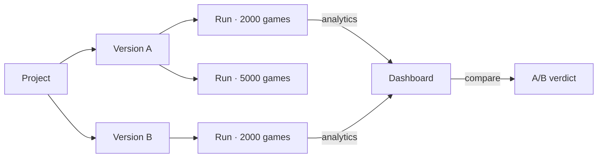

# How PlaytestAI thinks

The whole tool boils down to four nouns and one verb.

| Concept | One-line definition |
| --- | --- |
| **Project** | A game you are designing. Has a name, a description, and a list of versions. |
| **Version** | A versioned snapshot of rules + cards + resources. You duplicate, edit, archive. |
| **Run** | The result of simulating one version with one configuration. Immutable. |
| **Agent** | An AI strategy. Three are built in: Random, Greedy, Balanced. |
| **Simulate** | Run *N* games of a version with *K* agents, collect statistics, score the batch. |

That's it. Everything else in the UI is a window onto these five ideas.

## The loop

The design loop PlaytestAI is optimized for:

1. **Model** your rules in a version.
2. **Simulate** a batch (2,000 games is a good default).
3. **Read** the balance score and flagged issues.
4. **Duplicate** the version, tweak suspect cards.
5. **Re-simulate** the new version.
6. **Compare** the runs side-by-side.
7. **Promote** the winning version, archive the rest.

A skilled user goes around this loop dozens of times in an afternoon — each
iteration is single-digit seconds of compute.

## What's stored, what's recomputed

- **Stored** (in SQLite): projects, versions, runs (including their pre-computed analytics).
- **Recomputed** in the browser: nothing, by default. Runs are immutable snapshots.

This means: runs survive refreshes, you can share a database file with a
teammate, and you can replay any decision you made six months ago.

## What's deterministic

- Given the **same version** + **same config** (games, players, seed, agents),
  the engine produces **bit-identical results**.
- The seed flows through a small linear-congruential PRNG in `lib/simulation/rng.ts`.
- Agents that include randomness (`Random`, `Balanced`'s jitter) draw from this PRNG.

This is the difference between "vibes" and "evidence". A regression you can't
replay isn't a regression — it's a ghost story.

## Where to read next

- [Projects and versions](./projects-and-versions.md) — data model and lifecycle.
- [Simulation model](./simulation-model.md) — turn loop, decisions, resolution.
- [Agents](./agents.md) — what Random, Greedy, and Balanced actually do.
- [Balance score](./balance-score.md) — how the 0–100 number is computed.
