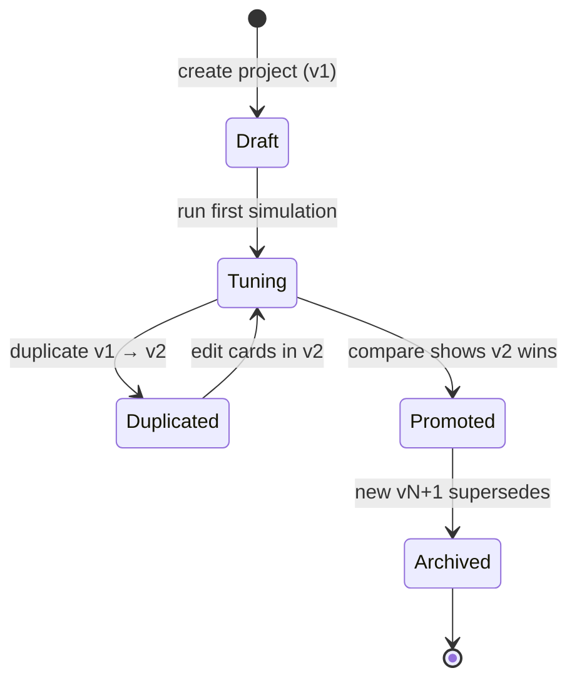

# Projects and versions

## Project

A **project** is one game you are designing. It owns a name, description,
created/updated timestamps, an ordered list of **versions**, and an ordered
list of **runs**.

```ts
interface GameProject {
  id: string;
  name: string;
  description: string;
  createdAt: string;
  updatedAt: string;
  versions: GameVersion[];
  runs: SimulationRun[];
}
```

Projects are the unit of sharing. Export a project (DB row + its versions + its runs)
and you've exported everything anyone needs to reproduce your balance work.

## Version

A **version** is a complete, self-contained snapshot of a game's rules:

```ts
interface GameVersion {
  id: string;
  projectId: string;
  label: string;            // "v1 — base", "v2 — Finisher nerf"
  published: boolean;       // visible in compare picker?
  playerCountMin: number;
  playerCountMax: number;
  winConditionType: "highest_score" | "first_to_x" | "last_standing";
  targetScore: number;
  maxTurns: number;
  startingHealth: number;
  startingHandSize: number;
  resources: ResourceDefinition[];
  cards: CardDefinition[];
  createdAt: string;
  updatedAt: string;
}
```

The key invariant: **a version is immutable in spirit**. You don't edit v1
after running 5,000 simulations against it; you duplicate v1 → v2 and edit
v2. This keeps runs honest — every run is tied to the exact version it was
simulated against.

In practice the UI does allow editing existing versions (useful while drafting
v1), but the recommended workflow is **duplicate before tuning**.

### Publishing and archiving

- **Published versions** show up in the compare picker and the API project
  payload as "active".
- **Unpublished versions** still exist, still have their runs, but are hidden
  from quick selection — handy for old or abandoned branches you want to keep
  for history.

## Run

A **run** is the immutable output of simulating one version with one config:

```ts
interface SimulationRun {
  id: string;
  projectId: string;
  versionId: string;
  label: string;
  createdAt: string;
  config: SimulationConfig;          // games, playerCount, seed, agentTypes
  result: SimulationBatchResult;     // win rates, rankings, summary, etc.
}
```

Once stored, a run is never re-computed. If you want fresh analytics, you run
a new simulation — your old runs stay as historical evidence.

## Lifecycle



## Persistence

Everything lives in a single SQLite file at `data/playtestai.sqlite`. The
schema is in [`lib/db/schema.ts`](https://github.com/TabletopFoundry/playtestai/blob/main/lib/db/schema.ts):

| Table | Rows |
| --- | --- |
| `projects` | One row per project. |
| `versions` | One row per version, JSON columns for resources/cards. |
| `runs` | One row per stored simulation. JSON column for the full result. |

Delete the file to reset everything to seed state. Copy it to another machine
to migrate your work.
