# The simulation model

PlaytestAI uses a deliberately **simplified card-battler loop**. The goal
isn't to faithfully simulate every mechanic in your real game — it's to
surface balance issues fast.

If your game *fits cleanly* into the model below, the balance score is highly
informative. If your game adds mechanics far outside the model (board
position, hidden information, drafting, deduction), treat results as a
sanity check rather than a verdict. See [Where the model fits](#where-the-model-fits) below.

## The turn loop

```mermaid
flowchart TD
  Start([Game start]) --> Setup[Build shared deck<br/>Deal opening hands<br/>Seat all players]
  Setup --> Turn{Turn loop}
  Turn --> Income[Each player gains<br/>resource.gainPerTurn]
  Income --> Decide[Active player&#39;s agent<br/>picks an affordable card]
  Decide --> Resolve[Apply card stats:<br/>power, damage, score,<br/>shield, draw, economy, custom]
  Resolve --> Win{Win condition met<br/>or turn cap?}
  Win -- no --> Turn
  Win -- yes --> End([Score game,<br/>record outcome])
```

## Phase by phase

### 1. Setup

- The shared deck is built by **expanding `quantity`** for every card.
- Each player starts with `startingHealth`, `startingHandSize` cards drawn,
  and `startAmount` of each resource.
- Seats are numbered 1..N (seat order matters for first-player tracking).

### 2. Income

- At the start of each player's turn, every resource gains `gainPerTurn`.
- All resources are aggregated into one **economy pool** for affordability checks.
  This is intentionally lossy — defining 5 colours of mana won't change which
  cards an agent can play, only the size of the pool.

### 3. Decide

- The agent looks at the player's hand, filters by **affordable** cards
  (cost ≤ economy pool), and picks one using its strategy. See [Agents](./agents.md).
- An agent can choose to **pass** (typical when nothing in hand has positive value).

### 4. Resolve

Every card stat the engine knows about does something:

| Stat | Effect |
| --- | --- |
| `power` | Added to the player's board power total (used in combat). |
| `damage` | Reduces an opponent's health (board power increases damage slightly). |
| `score` | Adds to the player's score. |
| `shield` | Heals the player (`shield / 2`). |
| `draw` | Draws additional cards. |
| `economy` | Adds to the resource pool. |
| `steal` | Reduces opponent's score by a fraction of `steal`. |
| `custom` (any other key) | Weighted at `0.35` per unit in agent valuation. |

The exact divisors and bonuses live in
[`lib/simulation/constants.ts`](../reference/simulation-constants.md) and are tunable.

### 5. Win check

After each turn the engine checks the win condition:

| Win condition | Trigger |
| --- | --- |
| `highest_score` | Game ends at `maxTurns`; highest score wins. |
| `first_to_x` | First player to reach `targetScore` wins immediately. |
| `last_standing` | Last player with `health > 0` wins. |

If no one wins by `maxTurns`, the game ends and we record the score state.

### 6. Record

Per game, the engine records:

- Winner (or tie).
- Winner's seat.
- Winner's agent type.
- Turn count.
- Cards played by everyone (and who won when each card was in play).

These per-game rows feed the analytics in [`lib/simulation/analytics.ts`](https://github.com/TabletopFoundry/playtestai/blob/main/lib/simulation/analytics.ts).

## Determinism

- A single PRNG (linear congruential, seeded by `config.seed`) drives all
  randomness: shuffling, agent jitter, tie-breaking.
- Same `(version, config)` → same result, every time.
- This is the single most important property of the engine. Treasure it.

## Where the model fits

PlaytestAI is a **good fit** for:

- Deck builders (Dominion, Star Realms, Aeon's End).
- Card-driven duelers (Hearthstone-style 1v1).
- TCG-style draft outcomes where deck composition is what you're tuning.
- Resource-and-tempo games with cost curves.

PlaytestAI is a **partial fit** for:

- Hidden-information games (Coup, Avalon) — agents see full hands.
- Spatial games — the engine has no board topology.
- Drafting and deck construction — out of scope at v0.1.

For partial-fit games, simulate the **combat / scoring sub-game** in
isolation. A 0–100 balance score on the resolved-conflict sub-game is still
useful information.
