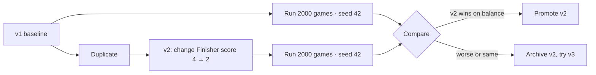

# A/B testing versions

The **Compare** tab is where designs are actually decided. It puts two (or
more) versions of the same project side-by-side and shows you, panel for
panel, how their simulations differ.

## The workflow

## Rules for honest A/B tests

1. **Same config, every time.** Use the same `games`, `playerCount`, `seed`,
   and `agentTypes` for both runs. If you change config between runs, you
   are not measuring the version change.
2. **Change one thing at a time.** If you nerf Finisher and buff Spark in
   v2, you cannot tell which change helped.
3. **Compare runs with the **same** game count.** A 500-game run and a 10,000-game
   run aren't directly comparable on rare-event metrics.
4. **Sanity-check with a second seed.** Once a candidate version looks good
   at seed 42, re-run it at seed 1337. If both seeds agree it's better,
   promote it.

## What to look at in the Compare panel

For each panel, look for **the same direction of change** across multiple
panels — that's a real effect, not noise.

| Panel | Better looks like |
| --- | --- |
| **Balance score** | Higher absolute value. |
| **First-player advantage** | Closer to zero. |
| **Strategy breakdown** | Closer to equal win rates among non-Random agents. |
| **Card rankings** | The previously-dominant card's `powerScore` dropped without others spiking. |
| **Length histogram** | Less concentration at the turn cap. |
| **Flagged issues** | Fewer issues, or different (lesser) issues. |

A version that wins on balance score but worsens length distribution often
indicates an over-correction. Take that signal seriously.

## Comparing more than two

You can select multiple runs across multiple versions. The dashboard renders
them in parallel. This is useful for **regression testing**: simulate v1,
v2, v3, v4 with the same config and verify each step is a monotonic
improvement.

## Archiving losers

Don't delete losing versions — *un-publish* them. The version stays in the
database for future reference, but it disappears from the active picker.
You'll thank yourself in three months when someone asks "did we already try
nerfing Finisher?"

## Common A/B mistakes

| Mistake | Why it bites |
| --- | --- |
| Comparing across game counts | Statistical confidence differs. |
| Comparing across seeds | Tail events differ; you can talk yourself into anything. |
| Comparing across agents | A change that helps vs. `random` may hurt vs. `balanced`. |
| Comparing months apart | Engine constants may have changed. Always re-simulate baseline. |
